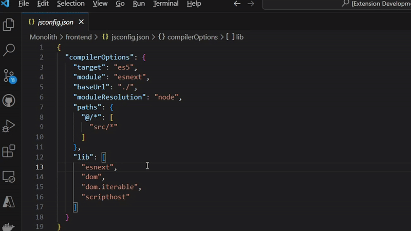

# 🧭 Breakpoint Navigator

**Mark lines of code as jump points and cycle between them without needing a debugger.**

---

---

## 🔧 Extension Settings

This extension contributes the following keybindings (customizable in Keyboard Shortcuts):

| Command | Keybinding | Description |
|--------|------------|-------------|
| `jumpPoints.mark` | `Ctrl+Alt+M` | Toggle a jump point at the current line |
| `jumpPoints.next` | `Ctrl+Alt+Right` | Go to the next jump point in the file |
| `jumpPoints.prev` | `Ctrl+Alt+Left` | Go to the previous jump point in the file |

---

## 📦 Release Notes

### 0.0.1 (2025-5-04)
- Initial release with core functionality:
  - Add/remove per-line jump points
  - Gutter icon decoration
  - File-local jump navigation
  - Persistent decorations across tab switches

### 0.0.2 (2025-5-05)
- Added logo to the README
---

## 💡 Contributing

Feature ideas, issues, or PRs are welcome — submit them via the [GitHub repo](https://github.com/masterx9/line-jump-navigator).

---

Enjoy using **Breakpoint Navigator**!
